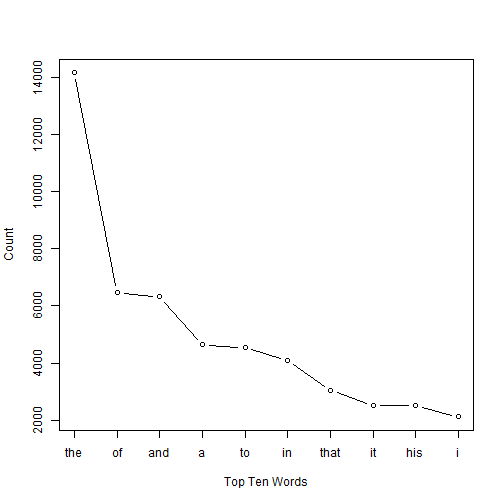

Micro Text Mining
========================================================

This is a set of R programs following the tutorials in Mathew Jocker's 'Text Analysis
with R' book.

In this file I go through some of the 'micro' analysis examples. Looking at detailed analyses on one data set.

Let's bring in the whole text for Moby Dick.


```r
text.v <- scan("http://www.gutenberg.org/cache/epub/2701/pg2701.txt", what = "character", 
    sep = "\n")
```

The scan function brings in a text file with one observation per line (/n).

This subsets the data to only include the book text (taking out the editorial stuff etc.).


```r
start.v <- which(text.v == "CHAPTER 1. Loomings.")
end.v <- which(text.v == "orphan.")
novel.lines.v <- text.v[start.v:end.v]
```


Collapse data into one string

```r
novel.v <- paste(novel.lines.v, collapse = " ")
```


Turn text to lower case letters and split into words.

```r
moby.words.l <- strsplit(tolower(novel.v), "\\W")
# splits the text at every non word character.
moby.words.v <- unlist(moby.words.l)
```


Delete the blanks from the file.

```r
moby.words.v <- moby.words.v[which(moby.words.v != "")]
```


Calculate the number of times the word 'whale' appears per 100 words of text.

```r
# Put a count of the occurecnes of whale into whale.hits.v
whale.hits.v <- length(moby.words.v[which(moby.words.v == "whale")])
# Put a count of total words into total.words.v
total.words.v <- length(moby.words.v)
# now divide
whale.hits.v/total.words.v * 100
```

```
## [1] 0.5352
```


Calc. Number of unique words

```r
length(unique(moby.words.v))
```

```
## [1] 16871
```

```r
# and table by frequency
moby.freqs.t <- table(moby.words.v)
# Frequency of he/she
moby.freqs.t["he"]/moby.freqs.t["she"]
```

```
##    he 
## 16.46
```

```r
# and plot top ten words
sorted.moby.freqs.t <- sort(moby.freqs.t, decreasing = T)
sorted.moby.freqs.t[1:10]
```

```
## moby.words.v
##   the    of   and     a    to    in  that    it   his     i 
## 14175  6469  6325  4637  4539  4078  3045  2496  2495  2114
```

```r
plot(sorted.moby.freqs.t[1:10], type = "b", xlab = "Top Ten Words", ylab = "Count", 
    xaxt = "n")
axis(1, 1:10, labels = names(sorted.moby.freqs.t[1:10]))
```

 


Word Distribution
------------------
  
Let's look at where certain words appear in the text and create
dispersion plots.

