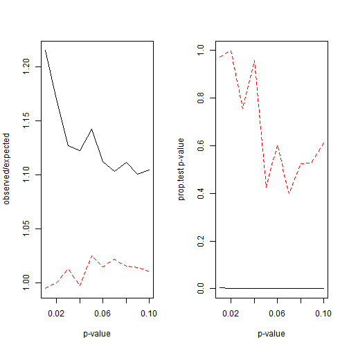

Calibration of p-value under variable selection: an example
========================================================
###November 14, 2013
###By Bogumil Kaminski
*(This article was first published on  R snippets, and kindly contributed to R-bloggers)* 

Very often people report p-values for linear regression estimates after performing variable selection step. Here is a simple simulation that shows that such a procedure might lead to wrong calibration of such tests.

Consider a simple data generating process where y ~ N(0, 1) and x1, x2 ~ U(0,1). Assume that we take n=20 independent samples of each of these variables.
We want to estimate model:

y = a0 + a1 * x1 + a2 * x2 + error
We know that true values of a1 and a2 are 0.

I will use two procedures that are used to estimate the model:
.Full: we estimate the full model
.Selection: we perform model selection using AIC criterion

We want to test whether parameters a1 and a2 are statistically significantly different than 0. 

In theory - if we set rejection threshold to p we expect that with probability p the null hypothesis will be rejected. I test this assertion by performing 10 000 Monte Carlo simulations of the model.

Below is the procedure I have used. I assume here that if variable is removed from the model by AIC criterion then it is treated as insignificant in calculations of observed p (i.e. H0 is not rejected).


```r
f <- function(do.setep) {
    
    n <- 20
    
    x1 <- runif(n)
    
    x2 <- runif(n)
    
    y <- rnorm(n)
    
    m <- lm(y ~ x1 + x2)
    
    if (do.setep) {
        
        m <- step(m, trace = F)
        
    }
    
    summary(m)$coef[-1, 4]
    
}


reps <- 10000

pvv <- seq(0.01, 0.1, by = 0.01)

prop <- NULL

test <- NULL


for (do.step in c(T, F)) {
    
    set.seed(1)
    
    p.x <- do.call(c, replicate(reps, f(do.step), simplify = F))
    
    prop <- cbind(prop, sapply(pvv, function(pv) {
        
        sum(p.x < pv)/(reps * 2 * pv)
        
    }))
    
    test <- cbind(test, sapply(pvv, function(pv) {
        
        prop.test(sum(p.x < pv), reps * 2, pv)$p.value
        
    }))
    
}
```

and the plot it produces:

```r
par(mfrow = c(1, 2))

matplot(pvv, prop, type = "l",

        xlab = "p-value", ylab = "observed/expected")

matplot(pvv, test, type = "l",
        xlab = "p-value", ylab = "prop.test p-value")
```

 


On the plots solid black line represents model with variable selection and dashed red line - model without selection. On both plots x-axis represents different values of p (threshold p-value ranging from 0.01 to 0.1; I use the same sample for different values of p to conserve simulation time - it would probably be more prudent to use separate samples to make observed values independent).

The left plot shows us what is the relation of observed number of H0 rejections to theoretical number of rejections. It can be clearly seen that in model without variable selection the test of H0 is approximately properly calibrated (ratio is approximately equal to 1). However in model with variable selection there are over 10% more rejections than expected (too many times a variable is judged as significant).

We can simply test if this bias is statistically significant. The results are shown on the right graph. The test shows that for model without variable selection the deviations are insignificant. On the other hand - for the model with variable selection we reject H0 that the observed number of rejections is unbiased.

